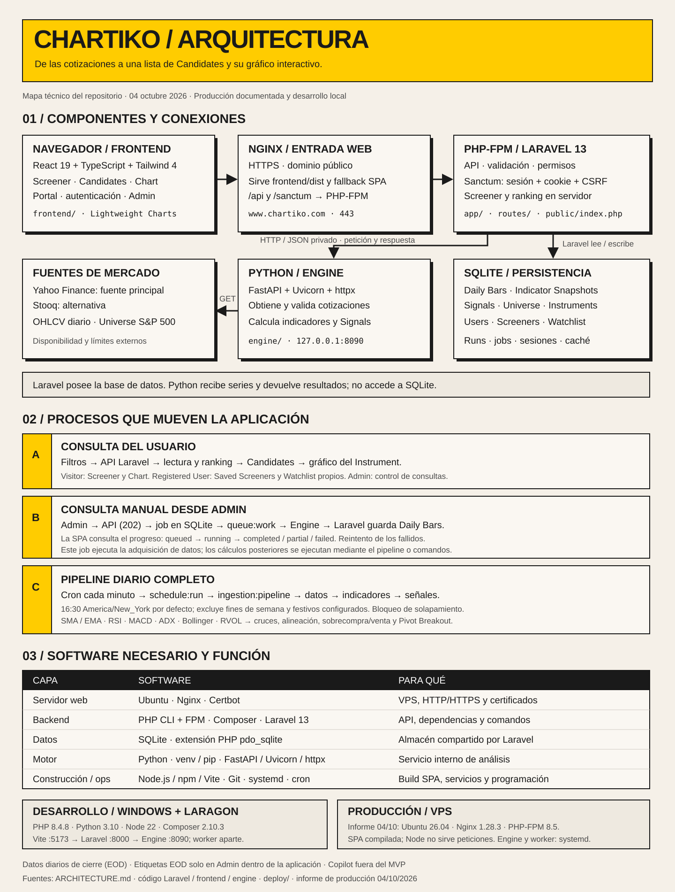

# Infografía de arquitectura de Chartiko

[Abrir el SVG a tamaño completo](arquitectura-infografia.svg). Es un archivo vectorial autónomo, ampliable e imprimible desde un navegador, sin fuentes ni recursos externos.

La infografía representa el código y los documentos disponibles el **4 de octubre de 2026**, actualizada el **10 de octubre de 2026** tras la migración de producción a PostgreSQL. Describe los componentes y sus responsabilidades; las versiones de producción se comprobaron en el VPS el 10/10 (Ubuntu 26.04, Nginx 1.28.3, PHP 8.5.4, PostgreSQL 18.6, PgBouncer 1.25.1).

## Detalles operativos

- **Frontend:** `frontend/` usa React, TypeScript, Tailwind y Lightweight Charts. Node.js, npm y Vite construyen `frontend/dist`; Nginx sirve esos archivos en producción.
- **Backend:** Laravel 13 requiere PHP compatible con `^8.3`, Composer y las extensiones configuradas en `deploy/setup-server.sh`: PDO PostgreSQL (producción), SQLite/PDO SQLite (desarrollo, tests y origen de rollback), mbstring, XML, cURL, ZIP, bcmath e intl. PHP-FPM atiende las solicitudes web; PHP CLI ejecuta Artisan, el worker y el scheduler.
- **Engine:** `engine/` dispone de un entorno virtual Python con FastAPI, Uvicorn y httpx (`engine/requirements.txt`). Escucha en `127.0.0.1:8090`, obtiene cotizaciones y devuelve cálculos por HTTP/JSON. Laravel realiza todas las escrituras en la base de datos; el Engine no accede a ella.
- **Datos:** en producción, PostgreSQL 18 detrás de PgBouncer (`127.0.0.1:6432`, modo transacción); las migraciones y copias usan la conexión directa `5432`. Cola, sesiones y caché usan el driver `database`, así que también viven en PostgreSQL. En desarrollo local y en el job `test` del CI se usa SQLite; el job `test-pgsql` repite la suite contra PostgreSQL y PgBouncer. Ver `docs/specs/db-postgresql-migration.md`.
- **Procesos persistentes:** Nginx, PHP-FPM, PostgreSQL, PgBouncer, el Engine y `php artisan queue:work`. Las unidades `alphapulse-engine` y `alphapulse-queue` conservan sus nombres internos históricos.
- **Proceso programado:** cron debe invocar `php artisan schedule:run` cada minuto. El evento Laravel ejecuta `ingestion:pipeline` a las 16:30 de Nueva York por defecto, con calendario y protección de solapamiento. Verificado en el VPS el 10/10: `/etc/cron.d/alphapulse` ejecuta `schedule:run` cada minuto como `www-data`, y las ejecuciones diarias de ingesta del 8 y 9 de octubre terminaron `completed`.
- **Admin y pipeline:** `RunIngestionJob` llama a `IngestionRunner` para adquirir y almacenar Daily Bars. El pipeline completo añade `indicators:compute` y `signals:detect`; iniciar una consulta desde Admin no ejecuta automáticamente esos dos pasos.
- **Acceso:** Sanctum autentica con sesión, cookie y CSRF. Laravel exige autenticación y propiedad para Saved Screeners/Watchlist, y rol Admin para las operaciones administrativas.

## Referencias del repositorio

- [Arquitectura detallada](../ARCHITECTURE.md)
- [Modelo de dominio](domain-model.md)
- [Dependencias frontend](../frontend/package.json), [backend](../composer.json) y [Engine](../engine/requirements.txt)
- [Configuración de despliegue](../deploy/) e [informe de producción](security/2026-10-04-141702-produccion.md)

La infografía no certifica el despliegue. El informe de producción conserva su dictamen y los riesgos pendientes; no se han modificado servicios ni configuración operativa para crear este documento.
