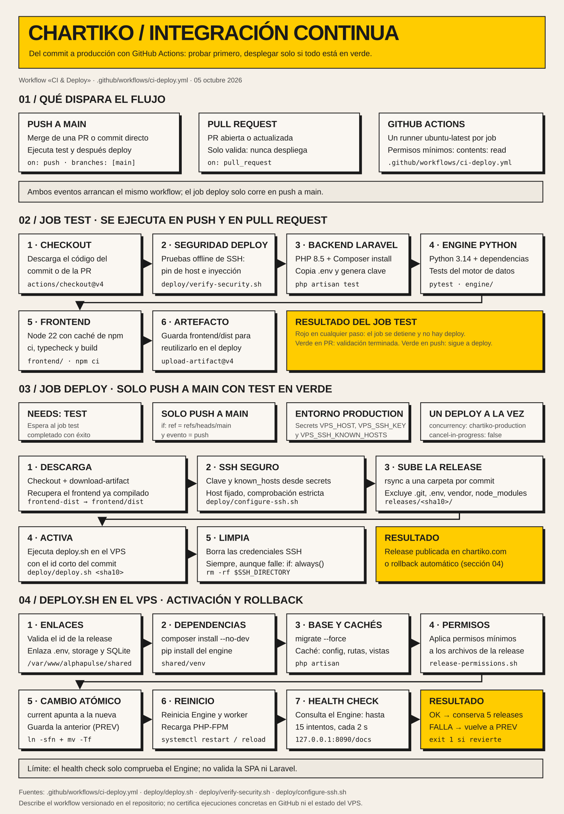

# Infografía del flujo de integración continua

[Abrir el SVG a tamaño completo](ci-flujo-infografia.svg). Es un archivo vectorial autónomo, sin fuentes ni recursos externos.

La infografía representa el workflow [`ci-deploy.yml`](../.github/workflows/ci-deploy.yml) y el script [`deploy/deploy.sh`](../deploy/deploy.sh) tal como están en el repositorio el **5 de octubre de 2026**.

## Resumen

- **Disparadores:** `push` a `main` y `pull_request`. Los permisos del workflow son `contents: read`.
- **Job `test`** (push y PR): pruebas de regresión de seguridad del despliegue (`deploy/verify-security.sh`), `php artisan test` (PHP 8.5), `pytest` del Engine (Python 3.14), `npm ci`, `typecheck` y `build` del frontend (Node 22), y publicación del artefacto `frontend-dist`.
- **Job `deploy`:** solo en `push` a `main` y con `test` en verde (`needs: test`). Usa el entorno `production` y el grupo de concurrencia `chartiko-production` sin cancelar despliegues en curso. Configura SSH con host fijado, sube la release por `rsync` a `releases/<sha10>/`, la activa con `deploy.sh` y borra siempre las credenciales SSH.
- **`deploy.sh` en el VPS:** enlaza `.env`, `storage` y SQLite compartidos; instala dependencias; ejecuta `migrate --force` y las cachés de Laravel; aplica permisos; cambia el enlace `current` de forma atómica; reinicia Engine y worker; recarga PHP-FPM; y comprueba el Engine. Si la comprobación falla, vuelve a la release anterior. Si pasa, conserva las 5 últimas.

## Límites

- El health check solo consulta `http://127.0.0.1:8090/docs` (Engine); no valida la SPA ni Laravel.
- El rollback revierte el enlace `current`, pero no deshace las migraciones ya aplicadas.
- La infografía no certifica ejecuciones concretas en GitHub ni el estado del VPS. No se ha ejecutado el workflow para crearla.
