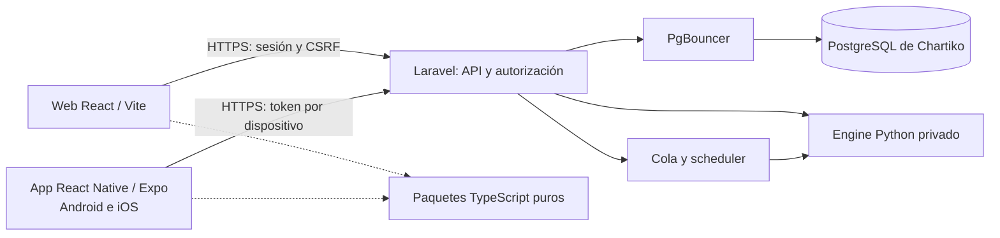

# Chartiko: Android e iOS junto a la web

Fecha: 2026-10-08. Estado: **propuesta de arquitectura y plan de trabajo**.
La solicitud autoriza preparar la skill y estudiar la conversión. Esta entrega
no incorpora una aplicación móvil ni modifica la API o el despliegue.

## Recomendación

React Native + Expo + TypeScript para una app que compile para Android e iOS,
en el mismo repositorio que la web y Laravel. Mantener frontend/ con React/Vite;
Laravel continúa como API y propietario de PostgreSQL; el engine Python conserva
sus tareas internas. Expo Router para navegación móvil y development builds para
probar capacidades nativas. Esta elección está alineada con la recomendación de
React Native [S1], pero debe confirmarse con el spike del gráfico.

| Opción | Ventaja para Chartiko | Coste o límite | Decisión |
|---|---|---|---|
| React Native + Expo | Ecosistema React/TypeScript, una app para ambos targets, herramientas de build | Las pantallas DOM se adaptan; gráfico y módulos requieren pruebas | Recomendada |
| React Native sin framework | Control directo de proyectos nativos | Más mantenimiento nativo sin necesidad observada que lo justifique | Reserva para un bloqueo demostrado de Expo |
| Capacitor | Mayor reutilización de frontend/ y del gráfico web | Mantiene una UI web que necesita adaptación táctil; comprobar experiencia y lifecycle | Alternativa si prima reducir coste y conservar la UI actual |
| Swift + Kotlin | Control nativo por plataforma | Dos interfaces y más especialización/mantenimiento | No justificado por el alcance actual |

No se promete un porcentaje de reutilización sin un prototipo. Lo más reutilizable
es el backend y la lógica TypeScript pura; pantallas, navegación y controles necesitan
trabajo móvil. Admin permanecería en la web inicialmente como supuesto de alcance.

## Evidencia local

| Archivo / área | Hallazgo | Implicación |
|---|---|---|
| ARCHITECTURE.md; routes/api.php | Laravel ya sirve datos y recursos personales a la SPA | Aprovechar sus reglas; no crear un segundo backend |
| frontend/package.json | React ^19.2.8, react-router ^8.4.0, Vite ^8.3.0, Lightweight Charts 5.2.1 | Son restricciones de manifest observadas, no versiones móviles elegidas |
| package.json raíz | Assets Laravel con su propio Vite; frontend/ tiene toolchain/lockfile propio | Workspaces será una transición explícita |
| AuthController.php | register/login/logout exigen requireStatefulSession | No funcionan como endpoints Bearer móviles tal cual |
| app/Models/User.php | Usa HasFactory y Notifiable; aún no HasApiTokens | Instalar Sanctum previamente no habilitó emisión móvil |
| frontend/src/lib/api.ts | Tipos y llamadas comparten un módulo orientado a cookies/CSRF | Extraer contrato y transporte por separado |
| i18n y lang/ | Español/inglés, Accept-Language y errores traducidos | Mantener paridad desde el primer flujo móvil |
| admin-users-sessions; PROGRESS.md | Gestión de sesiones web y auditoría con retención de 90 días | Añadir dispositivos/tokens de forma explícita, sin prometer revocación que no existe |
| engine/ y arquitectura | Python calcula/adquiere; Laravel persiste | Ningún cliente accede directamente al engine o a PostgreSQL |

El progreso registra una migración PostgreSQL posterior a documentación de riesgos
que todavía menciona SQLite. Este estudio no comprueba el servidor en vivo ni corrige
esa documentación histórica; al implementar se verificará el entorno real.
La exclusión de apps nativas del MVP original no bloquea este estudio solicitado.

## Arquitectura propuesta



Una misma cuenta permite consultar Watchlist y Saved Screeners desde ambos clientes.
El servidor conserva ranking, validación, ownership y reglas del dominio. Móvil
recibe Daily Bars, Indicator Snapshots y Signals; no calcula otra versión de ellos.
La presentación mantiene las fechas de mercado y USD, y no muestra etiquetas EOD
fuera de Admin. No se añade intradía, IA, pagos ni notificaciones.

### Contrato y acceso

Proponer /api/v1 para el contrato móvil inicial; mantener /api actual durante la
transición web. Ambos accesos deben reutilizar las mismas acciones/servicios y
serialización, sin copiar reglas. Documentar OpenAPI, casos de error y fixtures
reales antes de programar los consumidores. Generar tipos y verificar drift en CI.
No cambiar formas, estados o códigos Signal por idioma.

Recursos iniciales: Screener, Instrument detail, usuario actual, Watchlist y Saved
Screeners. Añadir endpoints móviles de registro, emisión/revocación de token y
gestión de dispositivos; nombres definitivos en la spec de autenticación.

- Web: conservar Sanctum con cookie HttpOnly y CSRF.
- Móvil: Sanctum Bearer por dispositivo, abilities mínimas y expiración explícita;
  propuesta inicial de 30 días configurable, con nuevo login al expirar.
- SecureStore guarda la credencial; nunca incluirla en una WebView, bundle o logs.
- Roles y ownership se validan siempre en Laravel. Si Admin queda fuera del móvil,
  denegar tokens móviles en rutas operativas incluso si el usuario tiene rol Admin.
- Añadir límite de dispositivos, limpieza de expirados y revocación de token actual/
  elegido; definir los valores en la spec. No ofrecer refresh OAuth implícito.
- Auditar accesos móviles con un identificador de dispositivo informativo y sin
  secretos. El login por token no debe omitir la auditoría por no usar el guard web.
- La pantalla Admin actual gestiona sesiones web. Para revocar acceso móvil necesita
  funciones propias: borrar una sesión no invalida un token. Separar ambas acciones.
- Compartir autorización de registro/credenciales como lógica del servidor; no
  eliminar requireStatefulSession del controlador web para acomodar el móvil.

Sanctum admite los dos mecanismos [S5]; estos endpoints, políticas y pruebas serían
trabajo nuevo. La primera entrega fijará duración y semántica de revocación.

### Compatibilidad entre releases

Clientes de tiendas pueden permanecer antiguos. Adoptar cambios aditivos, campos
nuevos opcionales y migraciones expandir/contraer. Propuesta: soportar al menos la
versión móvil actual y la anterior durante 90 días; documentar excepciones antes
de publicar. Mantener fixtures de esos consumidores contra cada release de API.
Un cambio incompatible introduce nueva versión, no rompe /api/v1 por sorpresa.

El backend compatible se despliega primero, después web y móviles a su ritmo.
Compartir un commit no exige publicar todos los clientes simultáneamente.

## Organización de Git

```text
ChartScreenPlus/
  app/ bootstrap/ config/ database/ routes/ tests/   # Laravel, ubicaciones actuales
  resources/ vite.config.js                        # assets Laravel
  engine/                                          # servicio Python
  frontend/                                        # SPA actual
  mobile/                                          # futura app Expo Android/iOS
    app/                                           # rutas Expo Router
    src/features/                                  # screener, chart, auth, portal
    src/platform/                                  # red, credenciales, lifecycle
    app.config.ts
    eas.json
  packages/
    contracts/                                     # tipos generados desde OpenAPI
    api-client/                                    # endpoints + transporte inyectado
    domain/                                        # serialización y funciones puras
    i18n/                                          # catálogos/formatters puros es/en
    design-tokens/                                 # valores compartidos, sin CSS/DOM
  docs/api/                                        # contrato y fixtures
  docs/mobile/
  .github/workflows/
  .opencode/skills/web-to-mobile/
```

El árbol mobile/, packages/ y docs/api/ es **propuesto**, no creado por esta tarea.
Crear cada paquete solo cuando tenga un consumidor real. Evitar una carpeta shared
sin límites y evitar dependencias de paquetes hacia aplicaciones. Los componentes
web no se importan en móvil.

Recomiendo npm workspaces para frontend/, mobile/ y packages/*, excluyendo alphapulse/.
Habrá un lockfile npm raíz para esos workspaces, conservando scripts y configuración
de assets Laravel. Esto cambia la regla actual de frontend/ independiente: necesita
una feature previa que actualice ARCHITECTURE/CONSTRAINTS, init.ps1 y CI, migre
lockfiles y pruebe instalación limpia. No forzar React con overrides sin comprobar
compatibilidad con el SDK elegido. Mantener Composer y Python independientes.

Usar main y ramas cortas feat/mobile-..., feat/api-..., feat/web-...; una app móvil
con targets Android/iOS. Worktrees por tarea cuando sea útil, sin ramas permanentes
por plataforma ni duplicar el backend. El responsable de cada PR resuelve contratos
y el lockfile antes de integrarlo; los contratos compartidos se coordinan primero.

Para CNG, app config/plugins son fuente; android/ios generados quedan ignorados.
Si un módulo exige mantener código nativo, documentar esa excepción y su mantenimiento
antes de cambiar esta política [S4]. No versionar claves de firma ni builds.

## Desarrollo en paralelo

| Línea | Puede avanzar con | Entrega común |
|---|---|---|
| API | Contratos y pruebas de ownership/credenciales | OpenAPI + fixtures + endpoint real |
| Móvil | Contratos publicados en el repo y mocks derivados | Pantallas sobre el cliente tipado, luego integración real |
| Web | API anterior compatible y paquetes puros | Regresión web y adopción gradual del cliente compartido |
| Integración | PRs pequeños y entorno staging | Compatibilidad y evidencias Android/iOS |

El paralelismo comienza después de acordar contratos y estructura; no obliga a
terminar toda la API antes de construir pantallas. Los mocks son provisionales y
no sustituyen la aceptación contra Laravel. Registrar dependencias de features
según el ciclo accepted del proyecto; cada tarea trabaja un incremento definido.

CI prevista:
- Laravel en SQLite y PostgreSQL/PgBouncer; Python conserva sus pruebas.
- Web: tipos, lint, Vitest y build.
- Shared: generación de contratos y pruebas puras; cambios shared/API ejecutan
  comprobaciones de todos sus consumidores.
- Móvil: tipos, componentes, export/bundle y builds nativos por el flujo acordado.
  iOS necesita runner macOS o EAS; no marcarlo validado por un test JS.
- Distribución independiente: web/backend por su pipeline; builds móviles por
  workflow explícito o tags mobile-vX.Y.Z. No publicar tiendas al hacer merge.
- El rsync actual publica gran parte del repositorio: ajustar exclusiones de mobile/
  y artefactos nativos y preservar lo necesario para construir la web.
- Mantener init.ps1 como gate local, incorporando checks móviles sin exigir macOS
  al desarrollador Windows; los gates nativos se verifican en su entorno.

## Gráfico: prueba antes de cerrar la elección

Lightweight Charts es una dependencia de navegador [S8]. Propuesta inicial:
pantalla nativa con una WebView restringida al gráfico, renderer empaquetado y
datos JSON públicos recibidos del cliente nativo. Conservar atribución TradingView.
No reutilizar directamente el componente DOM ni pasarle credenciales.

Comparar esa opción con un renderer nativo en un spike de 2–4 días: candles, volumen,
SMA como referencias del snapshot actual, pivot permitido, crosshair, zoom/pan,
rotación y dataset de hasta el límite vigente de la API. No inventar series históricas
de indicadores ausentes. Probar Android e iOS y registrar latencia, fluidez, memoria,
accesibilidad y estabilidad. Si falla la experiencia táctil, revisar renderer y plazo
antes de portar todas las pantallas.

## Entregas y esfuerzo

Estimación orientativa propia para una persona familiarizada con React/Laravel,
con API funcional, dispositivos y acceso a compilación iOS. Rangos de días efectivos;
no incluye revisión de tiendas ni funciones nuevas de negocio.

| Entrega | Dependencia | Resultado verificable | Días |
|---|---|---|---|
| Contrato y spike de gráfico | Estudio | OpenAPI inicial y decisión de renderer probada en ambos targets | 2–4 |
| Workspace y shell móvil | Decisiones anteriores | Instalación reproducible, web intacta, app de desarrollo en ambos targets | 2–4 |
| Auth y API móvil | Contrato | Registro/login, ownership, expiración/revocación y auditoría reales | 3–5 |
| Screener, chart, Portal y es/en | Shell; fixtures, luego API auth | Flujo público y privado completo integrado | 8–15 |
| QA y distribución interna | Flujos completos | Pruebas nativas, compatibilidad, signing y previews | 4–8 |

Total serial aproximado: **19–36 días efectivos (4–7 semanas)**.
Con responsables distintos para API y móvil pueden solaparse tareas; no dividir
el plazo automáticamente por el número de personas. El gráfico y QA iOS son las
mayores incertidumbres. La primera prueba reduce el margen antes de comprometer fecha.

## Decisiones pendientes y límites

- Confirmar la propuesta Admin solo web, alcance de registro y borrado de cuenta
  para la fase de distribución, y si se necesita offline real. Por defecto: lectura
  con estados sin red, sin cola de escrituras offline ni sincronización compleja.
- Seleccionar SDK/versiones compatibles al implementar, no imponer versiones desde
  ejemplos de documentación. Las versiones del manifest web deben seguir pasando CI.
- Windows sirve para Android local y desarrollo JS. iOS local requiere macOS/Xcode;
  EAS es alternativa de build remoto, con pruebas en iPhone por separado [S3, S10].
- Cuentas Apple/Google/Expo, identificadores, signing y costes se concretan antes de
  distribución. Revisar políticas vigentes y privacidad con el flujo real.
- Reglas de licencia/redistribución de datos ya abiertas en Chartiko siguen siendo
  relevantes al ampliar distribución; este estudio no las resuelve.
- Las decisiones anteriores son propuestas; no equivalen a implementación validada
  ni autorización para publicar. Siguiente incremento: contrato y spike del gráfico.

Fuentes S1–S12 y fechas:
[referencias de la skill](../../.opencode/skills/web-to-mobile/references/sources.md).

